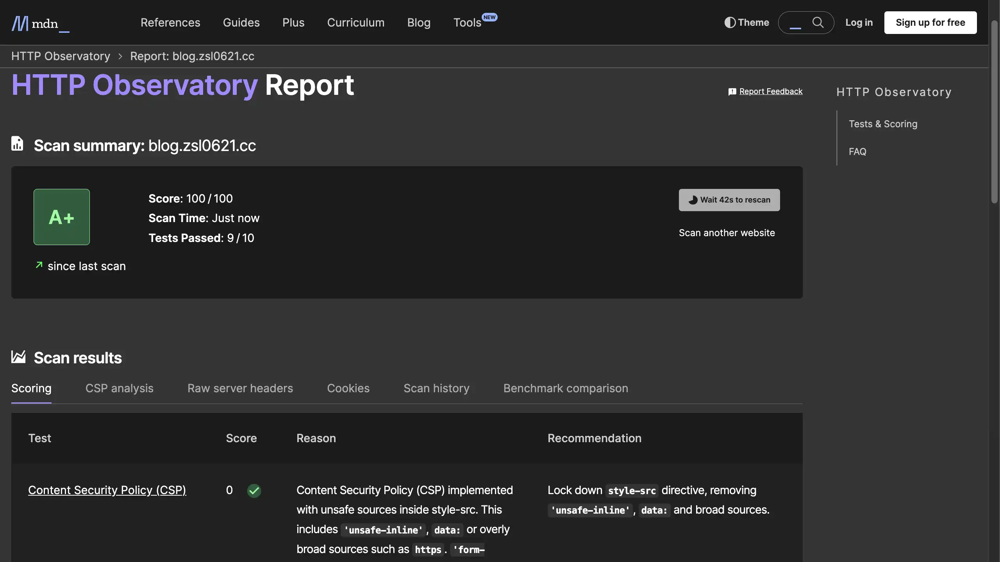

搞了半天的 [pagespeed](https://pagespeed.web.dev/) 終於能跑到滿分了，就是東加無障礙西減載入圖片，連我圖片比例不對都要管有夠麻煩，連強迫症的我都受不了惹。  

asd
然後 Google Tag Manager 竟然是我網站裡浪費最多載入時間的 js，原本還想說要不要刪了，但想想刪了速度我也沒感覺，但是看不到報表我很有感覺，就算不看放在那也爽。
das

 

---

 

2024/8/14更新：換字體前功盡棄adsd


改成[霞鶩文楷](https://github.com/lxgw/LxgwWenkaiTC)字體，很漂亮，也讓之前搞半天的速度直接炸裂，pagespeed 超級嚴格。

另外[找getdoks的時候](/posts/20240803/)發現 secure headers 這個東西，用 Cloudflare Workers 轉一下 headers 輕鬆從25分跑到滿分。不過因為網站除了 Github 也給 Cloudflare 託管， CSP 設定好之後後續加東西很麻煩，最後還是設定 unsafe-inline 了。話說 getdoks 的主題 [bolt](https://github.com/gethyas/bolt) 可以跑到120分高到破表，雖然那個網站除了文字以外啥都沒有。

