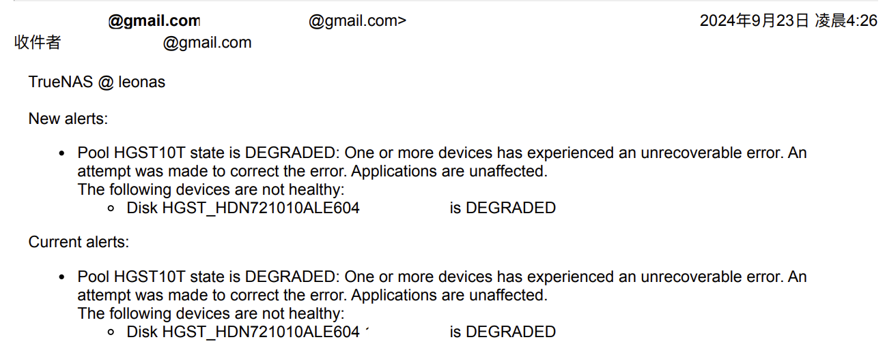

> 雖然是因為二手硬碟就是了

# 經過
當初看到 10T HDD 全盤慢速掃描無壞軌無警告無 info，S.M.A.R.T. 數據除了使用時間長了點也沒什麼問題，才賣 3000 覺得不錯，考慮幾天後就買了，結果裝了兩天之後 TrueNAS 就開始寄信給我

想說還有得救，先進後台管理頁面點了 scrub，結果也沒用，繼續抱著僥倖心態先清除錯誤 `sudo zfs clear`，然後不到 12 小時後半夜四點又寄信給我，心理想說完ㄌ，不信邪手動打 `sudo zfs scrub HGST10T` (註：這裡名稱直接打幫分區取的名字而不是 /dev/sdx) 還是一樣，最後只好跟賣家溝通退貨，還好他是個好人可以退貨。

> 更新：退貨前忘記先拿正常運作的硬碟交換線材測試，因為[線材和電源](https://blog.user.today/10-free-truenas-note/)也可能造成問題。

 

# 學到了什麼
## smartctl
1. `smartctl -a` `smartctl -x` 可以查看更詳細的 S.M.A.R.T. 資訊
2. `sudo smartctl -t <short|long|conveyance|select> /dev/sdc` 有四種模式選擇，其中 conveyance 用於新硬碟檢測運輸時造成的錯誤

## ZFS
1. ZFS 是不是比其他 file system 檢測更嚴格？使用期間使用無異狀但是已經發現錯誤報錯了，網路上一堆硬碟掛了才在唉唉叫的案例（包括三年前直接壞整顆資料碟的我...）
2. `zpool status -v` `zfs clear` `zfs scrub <pool>` 的使用，其中 scrub 有點類似 `fsck` 但不一樣，網路上說一樣的是錯誤資訊，詳情請見這份[文檔](https://illumos.org/books/zfs-admin/gavwg.html)，簡單來說 fsck 檢查文件系統結構性故障，zfs scrub 使用 checksum 修復數據層面故障
3. oracle 建議每個月 scrub 一次硬碟
4. 原來 TrueNAS 可以用 zfs 指令，剛學的時候沒加 sudo 不能就以為他鎖住了（packages 相關的全被鎖住）
5. 既然可以用之後可以限制一下 zfs 記憶體用量，甚至還有過 free mem 0 Bytes (24.04.0 版[這個方法](https://jose.scjtqs.com/truenas/2023-10-08-1972/truenas-scale-%E8%B0%83%E6%95%B4%E9%BB%98%E8%AE%A4%E7%9A%84-arc%E5%86%85%E5%AD%98%E5%8D%A0%E7%94%A8%E8%A7%84%E5%88%99.html)沒用)

## 硬碟
1. 即使全盤掃描無壞軌，S.M.A.R.T. 資訊也良好，硬碟也可能有問題
2. 學習到新的硬碟參數：裝載/卸載週期 (load/unload cycles) 代表磁頭上下的次數
3. 再次提醒自己硬碟工作溫度 45 度以下，最好在 40 度
4. 實際使用時間約在 MTBF 標示的一半，但是 [AFR 數值比較重要](https://www.seagate.com/tw/zh/support/kb/hard-disk-drive-reliability-and-mtbf-afr-174791en/)

# 硬碟產品調查
接著是自己的筆記，免的每次研究完隔一陣子就忘記

> 比較 [ST4000VN006](https://www.seagate.com/www-content/datasheets/pdfs/ironwolf-18tb-DS1904-20-2111TW-zh_TW.pdf) 和 [ST4000VX016](https://www.seagate.com/files/www-content/datasheets/pdfs/skyhawk-3-5-hdd-DS1902-17-2107TW-zh_TW.pdf)，於 2024/09/24 的研究

1. 便宜二手硬碟夢碎，去找新硬碟發現 4T 監控碟異常便宜
    1. IronWolf 非 pro 系列誰買誰傻逼，連官方都說不出來他有什麼具體差異，就多了一個 IHM，用 smartctl 也可以看到[一樣的東西](https://www.truenas.com/community/threads/seagate-iron-wolf-%E2%84%A2-health-management.58629/)
    2. IronWolf 系列 8T 以上才有錯誤率降低
    3. 裝載/卸載週期 WD 同價位產品只有 300K，seagate 標榜 600K
    4. 裝載/卸載週期即使是 WD 黑標也只有 300K，錯誤率同樣是 1E-14，驚不驚喜意不意外，盤到爛掉
    5. 總結以上，對於簡單單人使用或者不常隨機讀取的狀況，監控碟也許是不錯的選擇，因為隨機讀取少，單純寫入則更加適合監控硬碟只寫入的使用環境（也就是小姐姐的大 house XD）
    6. 監控碟其他容量都不划算
5. 第二選擇就是企業級硬碟，還是老路一條找南京梵多
6. 還真的很少看到有人特地去買 NAS 硬碟，不是找便宜的就是找企業級，這就是 M 型化社會嗎

參考資料，這就是看了又忘記的例子，寫這篇前搜尋到又點進去看發現忘的差不多了  
[新酷鹰4T怎么样？对于紫盘有什么优势？——希捷 ST4000VX016评测](https://www.youtube.com/watch?v=bi4f5eN9LoU)  
[2024新年特輯：NAS專用盤是智商稅嗎？——希捷酷鷹4T、酷狼4T和群暉4T對比](https://www.youtube.com/watch?v=IR9LW3oOeEg)（省流：是。）
