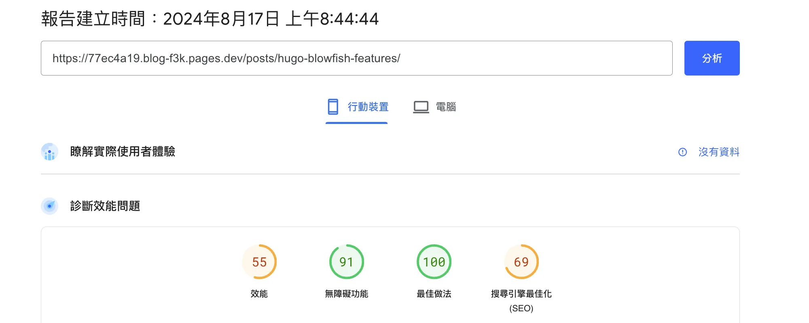
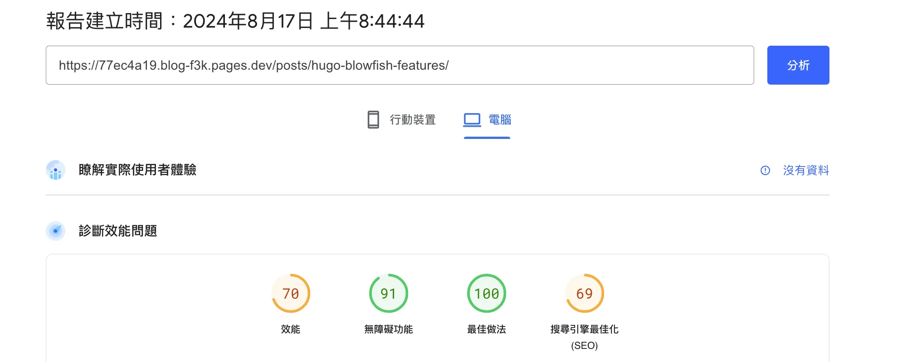
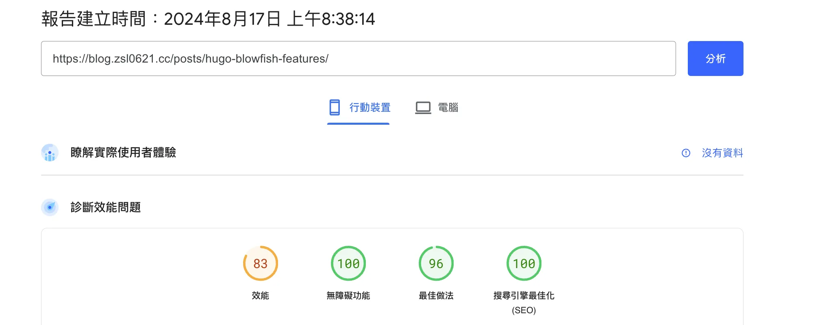
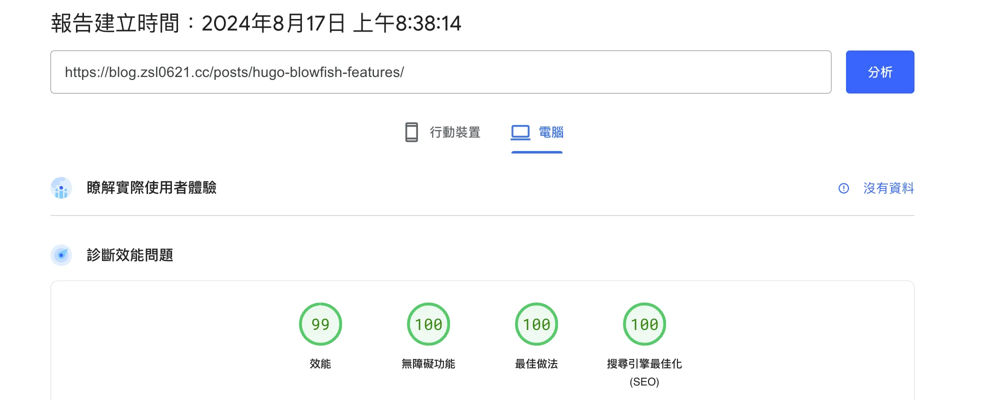

突然有點能體會到水影片的感覺了，是的這篇文章很水。

這是把語法上色從 chroma 改成 prism.js/highlight.js 又改成 shiki 的心得，網路上你哪裡能找到全部試過一輪的心得呢。

# Chroma
這是 Hugo 內建的語法上色方式，以 Blowfish 主題來說可以在 `assets/css/compiled/main.css` 找到，然後你會發現多到發瘋的高亮選項，哪個正常人會跑去修改這個。想改的原因不外乎就是顏色醜，上色語法錯誤，這裡兩個都發生了於是考慮別的上色方式。

一樣保持著一勞永逸的想法（雖然成功率好像滿低的）先去查到底哪個 highlighter 好，2018 2019年那些文章大概都說 Prism.js，說維護的比較勤 contributor 比較多，那就先選 Prism.js 好了

# Prism.js 和 Highlight.js
就說是來水文章的，這兩個對我來說根本沒啥差別，Prism.js 裝好沒半小時去官方 Github 看發現上次更新已經是 2022，於是果斷換成 Highlight.js，裝了也很輕鬆兩行 `<link>` `<script>` 就搞定，只是痛苦這裡才開始。首先，我已經知道 PageSpeed Insights 這個邪惡的東西，裝完之後手賤去測試果然慢了不少，因為他是用戶載入頁面後即時渲染的；再來是暗色模式支援，還自己寫了四個 javascript 搞定亮暗主題轉換問題：



```html
<!-- partials/extend-head.html -->
<link id="light-mode-css" rel="stylesheet" as="style" crossorigin="anonymous" referrerpolicy="no-referrer"
    href="https://cdnjs.cloudflare.com/ajax/libs/highlight.js/11.10.0/styles/nnfx-light.min.css"
    integrity="sha256-roHDdCpzJHruZzg09T0xn8BZQy6PDIWCR2mjy3Sp1iA=" />

<link id="dark-mode-css" rel="stylesheet" as="style" crossorigin="anonymous" referrerpolicy="no-referrer"
    href="https://cdnjs.cloudflare.com/ajax/libs/highlight.js/11.10.0/styles/nnfx-dark.min.css"
    integrity="sha256-aZYmPW0FYMBJ2LAv+S8cuVc7kCUaKqoq12pf4YMakFY=" />

<script crossorigin="anonymous" referrerpolicy="no-referrer"
    src="https://cdnjs.cloudflare.com/ajax/libs/highlight.js/11.10.0/highlight.min.js"
    integrity="sha256-Rx75rpDEB69ED83Ejt/utWIQazJnvRLZkHHBYvtS7TI="></script>
    
<script crossorigin="anonymous" referrerpolicy="no-referrer" async
    src="https://cdnjs.cloudflare.com/ajax/libs/highlight.js/11.10.0/languages/matlab.min.js"
    integrity="sha256-b4Mp6eYO0H7GNjWkL4yUNrSbUg/lKvwuxk9KZWdKtCg="></script>

<script>hljs.highlightAll();</script>
<script src="{{ "js/hljs-copy.js" | absURL }}"></script>
```


```js
// appearance.js
const setHighlightJsTheme = () => {
  const isDarkMode = document.documentElement.classList.contains("dark");
  document.getElementById('light-mode-css').disabled = isDarkMode;
  document.getElementById('dark-mode-css').disabled = !isDarkMode;
};

// 還要在每個this.updateLogo下面增加
this.updateLogo?.(targetAppearance);
setHighlightJsTheme();
```

```js
// static/js/hljs-copy.js
document.addEventListener('DOMContentLoaded', (event) => {
  const container = document.querySelector('body');

  container.addEventListener('click', (event) => {
    if (event.target.classList.contains('copy-btn')) {
      const button = event.target;
      const codeBlock = button.previousElementSibling;
      const text = codeBlock.innerText;

      navigator.clipboard.writeText(text).then(() => {
        button.innerText = 'Copied!';
        setTimeout(() => {
          button.innerText = 'Copy';
        }, 2000);
      }).catch(err => {
        console.error('Failed to copy text: ', err);
      });
    }
  });

  document.querySelectorAll('pre code').forEach((codeBlock) => {
    const button = document.createElement('button');
    button.className = 'copy-btn';
    button.type = 'button';
    button.innerText = 'Copy';
    
    codeBlock.parentNode.appendChild(button);
  });

  document.querySelectorAll('pre code').forEach((block) => {
    hljs.highlightElement(block);
  });
});
```

```css
/* custom.css */
pre {
    white-space: pre !important;
    overflow-x: auto !important;

    tab-size: 2 !important;
    -moz-tab-size: 2 !important;

    padding: 0 !important;
    position: relative;
}

.copy-btn {
    position: absolute;
    top: 0;
    right: 0;
    color: var(--text-color-neutral-700);
    background: rgb(var(--color-neutral-700), 0.);
    border: none;
    padding: 1.2px 12px;
    cursor: pointer;
    font-size: 0.875rem;
    border-radius: 0 0 0 10px; /* 左下角圓弧 */
    transition: background-color 0.3s ease; /* 平滑過渡效果 */
}

.copy-btn:hover {
    background-color: rgba(var(--color-neutral-700), 0.3); /* 滑鼠經過時顯示背景顏色 */
}

.dark .copy-btn {
    background-color: transparent;
}

.dark .copy-btn:hover {
    background-color: rgba(255, 255, 255, 0.1); /* 暗黑模式下滑鼠經過時的背景顏色 */
}
```


奇怪不是兩個 javascript 嗎？哪來的四個，因為還有兩個寫完之後發現寫太爛了打掉重練，單純只加 Highlight.js 確實是像教學[[1]](https://note.qidong.name/2017/06/24/hugo-highlight/), [[2]](https://sujingjhong.com/posts/switch-prismjs-to-highlightjs-in-hugo/), [[3]](https://blog.xpgreat.com/p/hugo_add_highlight/)一樣複製貼上就結束了，但是改成 Highlight.js 缺失的主題切換和複製按鈕我都要重新寫，那些 CSP referrerpolicy, defer/async, crossorigin, integrity 教學也沒講到，查到 CSP 之後又用 Cloudflare Workers 寫了一個修改 HTTP headers 的程式：

```js
// Cloudflare Workers
const cdns = `
  https://cdnjs.cloudflare.com
  https://cdn.jsdelivr.net
  https://fonts.googleapis.com
  https://fonts.gstatic.com
`.trim().replace(/\n\s+/g, ' '); 

addEventListener('fetch', event => {
  event.respondWith(handleRequest(event.request))
})

async function handleRequest(request) {
  let response = await fetch(request)

  let newHeaders = new Headers(response.headers)

  newHeaders.set('Strict-Transport-Security', 'max-age=31536000; includeSubDomains; preload')
  newHeaders.set('X-Content-Type-Options', 'nosniff')
  newHeaders.set('X-XSS-Protection', '1; mode=block')
  newHeaders.set('Content-Security-Policy', `
    object-src 'none';
    default-src 'self';
    manifest-src 'self' https://*.zsl0621.cc;
    connect-src 'self' ${cdns} https://www.google-analytics.com;
    font-src 'self' ${cdns};
    img-src 'self' https://*.zsl0621.cc;
    script-src 'self' https://*.zsl0621.cc ${cdns} https://www.googletagmanager.com https://analytics.google.com  https://static.cloudflareinsights.com 'unsafe-inline';
    style-src 'self' https://*.zsl0621.cc ${cdns} 'unsafe-inline'
  `.replace(/\n/g, ' ').trim())
  newHeaders.set('X-Frame-Options', 'SAMEORIGIN')
  newHeaders.set('Referrer-Policy', 'strict-origin')
  newHeaders.set('Permissions-Policy', 'geolocation=(self), microphone=(), camera=()')
  newHeaders.set('Cache-Control', 'public, max-age=31536000')

  const origin = request.headers.get('Origin')
  if (origin && origin.match(/^https:\/\/.*zsl0621\.cc$/)) {
    newHeaders.set('Access-Control-Allow-Origin', origin)
  } else {
    newHeaders.set('Access-Control-Allow-Origin', '*')
  }

  return new Response(response.body, {
    status: response.status,
    statusText: response.statusText,
    headers: newHeaders
  })
}
```

越搞越多跟想像的三行優雅解決完全不一樣...都破百行了，最重要的是原本用好的[超過100分](/posts/20240728/)經過字體和高亮 CDN 以及我外行人寫的 javascript，速度直接噴到剩下50分：


原本的沒有存結果，這是用 Cloudflare Pages Rollbacks 功能留下來的頁面跑分的，應該也享受他們的 CDN 服務，記得剛部屬完 Highlight.js 後手機測速有時候還跑不到50分。


# Shiki
我辛苦弄這麼久的結果雖然是好看了但是分數有夠難看，那我之前的努力算什麼，就在我覺得好像沒救的時候看到了[這篇文章](https://www.eallion.com/hugo-syntax-highlight-shiki/)，插入也有夠簡單而且內建亮暗主題切換，重點是純靜態，拿他的網頁去跑分即使程式碼數量比我多的也是輕鬆跑到99, 100，好啊心態沒了，馬上改全刪，於是現在的跑分成績：



完美，回來了。

# 後記
當然這些成績還是要被 CDN 快取完才會有，剛部屬完馬上測試成績會很差，不過光我一個人隨便點幾次就快取到了。

複製功能自己寫完發現其實是 Blowfish 的 [bug](https://github.com/nunocoracao/blowfish/issues/1691)，暫時就先不放了。

eallion 寫的 Shiki 教學就是我最喜歡的那種，有介紹原因，直接教學，沒有廢話，沒有拖泥帶水，清楚了當。

最後，你說70分和100分體感有差嗎？完全沒差，但是我比較爽。
