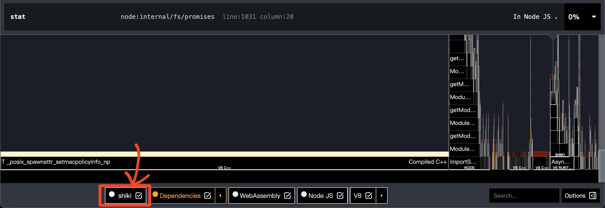
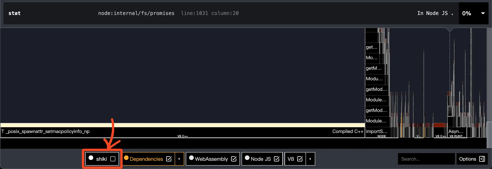
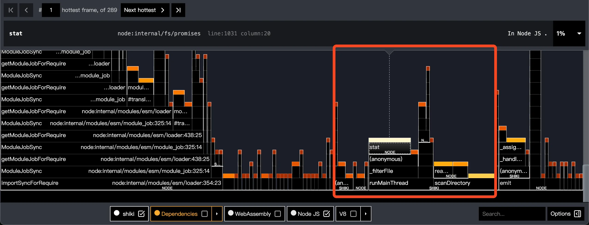

先說本文和大部分使用 shiki 的人無關，這篇的目的是將**已經 build 完成的 html 頁面中加入 shiki highlight**。

# 前言

原本是想寫使用教學的，並且都想好要針對最多人用的 PaperMod 主題作為範例，但是實際使用時發現有些主題修改了 code block 的 CSS，這會導致教學內容不會永遠成立，所以變成內容就變成效能分析了。

事情是這樣的，Hugo 內建的 Chroma highlight 語法解析錯誤百出，明明都是 `指令 --參數` 格式結果上下兩行 highlight 結果不一樣，除此之外主題切換[要這樣用](https://gohugo.io/commands/hugo_gen_chromastyles/)有夠麻煩，我換了一個就懶的再試第二個了，後來就直接換成 PrismJS 和 HLJS，但是這是客戶端渲染，之後又看到 eallion 的 [shiki 文章](https://www.eallion.com/hugo-syntax-highlight-shiki/)，效能死宅的我二話不說馬上換成 shiki。

本文使用前需要注意幾個問題

1. Code block 的語言務必正確標記，否則會完全沒顏色
2. 不同主題的 CSS 需要各自處理，本文只提供 Blowfish 和 PaperMod 作為範例
3. Code copy buttom 也很有可能消失，也需要自行解決
4. 開發階段即時預覽的功能不適用於 `hugo server --renderToMemory`

# 不同做法

## Eallion 的做法

分成三個步驟

1. 關閉 Hugo 內建的渲染
2. 設定 rehype 和 shiki 的 cli
3. 以 rehype 的 cli 幫已經建立好的 HTML 頁面加上 shiki 語法

這會有幾個問題，第一是速度非常慢，我才不到 60 個 md 文件就要六秒渲染，eallion 的網站有 600 個 md 文件耗時 191 秒；第二個是消耗記憶體，他會一次吃目標資料夾裡面的所有全部 HTML 文件，運行時要求非常大的記憶體容量；第三是無法在編輯時預覽，要開啟另外一個終端執行 shiki 上色指令才可以看到語法上色結果。

> 以 eallion 的網站作為測試，在 M1 MacBook Pro 上執行 rehype shiki cli，耗時 191 秒。

## Orta Therox 的做法

Orta 是 shiki 的 contributor，不只是 contributor，他的部落格也剛好是用 Hugo 搭建的，所以[他的方式](https://github.com/shikijs/shiki/issues/495#issuecomment-2188134630)應該很有參考性：以腳本執行 shiki，無須 rehype 並且有基本的過濾機制，不過沒有進階的效能優化。

> 以 eallion 的網站作為測試，在 M1 MacBook Pro 上執行 Orta Therox 的 [shikify.ts](https://github.com/puzzmo-com/blog.puzzmo.com/blob/6303077da805847717067cd369be4041f171a389/scripts/shikify.ts) 耗時 5.9 秒。

## 我的做法

同樣是使用腳本方式完成，並且有幾個優化

1. 更複雜的過濾方式
   1. 可以指定哪些目錄需要修改
   2. 每個目錄可以指定排除的路徑，例如 Hugo 會自動生成 page 頁面，此路徑的 HTML 全數排除
   3. 對於大型專案，可以設定開發時只監視指定目錄避免不必要的重渲染
2. 開發階段增量處理：根據觀察，由於本地開發時 Hugo 只會重新渲染和這次修改有關的檔案，所以基於 HTML 檔案的修改時間進行快取，避免不必要的重複處理
3. 更高效的處理方式
   1. 使用非同步方式處理檔案 IO，使用多線程完成 shiki 渲染
   2. 根據 CPU 核心數、待處理檔案數量設定線程數
   3. 每個線程一次獲取批量任務避免通訊開銷
   4. 根據觀察，多數 HTML 頁面其實沒有 code block，因此使用 early return 避免 parser 解析壓根沒有 code block 的頁面
   5. 使用高效的 htmlparser2 而不是 jsdom/cheerio

> 以 eallion 的網站作為測試，優化完成後在 M1 MacBook Pro 上執行只需要 1.88 秒，並且開發時預覽修改可以在一秒內完成。

# 效能分析

總結三種方式，以 CLI 方式完成最簡單但是耗時 191 秒，而 Orta 只是簡單的換成腳本就可以把時間縮短到 5.9 秒，有 32 倍的效能提升；我的方式經過一堆有的沒的優化之後可以把時間再度壓縮到 1.88 秒，速度提升高達 101 倍，而且在開發階段由於不需要重複渲染，所以在 0.8 秒左右就可以完成 highlighting，速度提升高達 240 倍；如果你是個狠人，限制 `TARGETS_DEV` 只有一個資料夾的話，在開發階段你可以在 0.25 秒完成渲染，速度提升 764 倍。


---
config:
    xyChart:
        width: 1000
        height: 600
    themeVariables:
        xyChart:
            plotColorPalette: "#00A2ED"
---
xychart-beta
    title "測試 eallion.com 使用不同方式進行 shiki highlight 的速度提升倍率"
    x-axis ["My script (cached with limit target)", "My script (cached)", "My script (uncached)", "Orta's script", "Rehype CLI"]
    y-axis "Speedup Multiplier" 0 --> 800
    bar [764, 238.75, 101.6, 32.37, 1]



進一步使用 [clinic.js](https://github.com/clinicjs/node-clinic) 進行效能分析，以 `pnpm clinic flame -- node scripts/shiki/index.js` 測試，完整的火焰圖如下：



可以看到 V8 引擎佔據七成時間，這時如果把我們自己的 shiki 關閉，再來對比上下兩張圖，可以看到差距非常小，代表沒有優化空間了：



如果真的要深入進行 profile，我們把 V8 和依賴的耗時都關掉，結果如下



可以看到我們的腳本耗時一半在掃描檔案上，因為 eallion 的目錄有高達 6000 個資料夾 (`find ./public -mindepth 1 -type d | wc -l` 輸出 6451)，所以耗時長是可以預測的。

唯一一個要改的地方是在 dev 階段，應該讓線程和 shiki highlighter instance 持續存活，但是現在是直接呼叫腳本重新執行。

# 使用教學

本文的程式碼位置在這裡：

- [scripts/shiki](https://github.com/ZhenShuo2021/ZhenShuo2021.github.io/tree/d05baff825515daa69a5d4cd0bbd60d806ec5230/scripts/shiki)：highlight 的一次性腳本
- [dev.js](https://github.com/ZhenShuo2021/ZhenShuo2021.github.io/blob/d05baff825515daa69a5d4cd0bbd60d806ec5230/scripts/dev.js)：用於開發階段及時預覽

## 設定方式

先做好 Hugo 設定，例如關閉 Hugo 的 code fences 和設定 CSS，[eallion 部落格](https://www.eallion.com/hugo-syntax-highlight-shiki/)有說明如何操作，

```toml
[markup]
  [markup.highlight]
    codeFences = false  # 關閉 code fences
```

完成設定後複製我的原始碼，使用 `node scripts/shiki/index.js` 就可以幫 HTML highlight 了，如果你是不同主題還要修改 CSS。

設定 CSS 就比較麻煩，因為有些主題會修改 code block 的 CSS，例如最多人用的 PaperMod 就有這個問題，以 Blowfish 為例 `custom.css` 只需要依照 shiki 官方的文檔修改：

```css
/* Blowfish 主題只需要按照 shiki 官方的用法設定 */

.dark .shiki,
.dark .shiki span {
  color: var(--shiki-dark) !important;
  background-color: var(--shiki-dark-bg) !important;
}
```

然而在 papermod 這個主題，我們需要改成

```css
/* 在 PaperMod 主題要改成這樣 */
.post-content .shiki {
  border-radius: var(--radius);
  overflow: hidden;
}

.post-content .shiki code {
  background: transparent !important;
  color: inherit !important;
}

.dark .post-content .shiki {
  background-color: var(--shiki-dark-bg) !important;
  color: var(--shiki-dark) !important;
}

.dark .post-content .shiki span {
  color: var(--shiki-dark) !important;
  background-color: transparent !important;
}
```

除此之外由於 PaperMod 主題的背景純白，所以我們不能使用白色背景的 highlight 主題，經過測試我覺得比較柔和識別度又高的主題是 LIGHT: "solarized-light", DARK: "everforest-dark"。

## 修復 Code Copy

這裡以 Blowfish 主題為例，一樣是不同主題的設定方式不同。Blowfish 複製按鈕在 `themes/blowfish/assets/js/code.js` 裡面，簡單來說就是找到所有的 `highlight` class，這是 Hugo 內建的 code block 標示，然後每個都加上複製按鈕，把 codeFences 關閉後這個 class 也沒了，所有又要自己處理。

廢話不多說，修改程式碼，在 `assets/js/code.js` 貼上以下設定就完成了：



## 使用須知

1. 腳本的原理只是找到指定的 html，看看裡面有沒有 `<pre><code` 需要被處理，有的話就定位裡面的 `<code class="language-CODE_LANGUAGE">` 幫指定語言上色
2. 如果你的 HTML 沒有被上色，請檢查 config.js 裡面的 TARGETS 設定，或者如上一個段落說的檢查 CSS
3. 如果你的語言不在預設範圍內，請在 LANGUAGES 新增語言；如果你的語言沒辦法被正確識別，使用 LANGUAGE_ALIAS 做映射
4. `node scripts/shiki/index.js --dev` 可以將目標目錄改為 `TARGETS_DEV` 以便開發時迅速預覽
5. Shiki 直接修改 HTML，所以你的檔案會變大，Hugo minify 也會不那麼 mini，但是經過測試的結果如下，一樣是 eallion.com：

```txt
❯ uv run top_10_diff.py
+580.0K 108.0K → 688.0K (+537.0%)       public/weasel/index.html
+140.0K 92.0K → 232.0K  (+152.2%)       public/blog-heatmap/index.html
+132.0K 92.0K → 224.0K  (+143.5%)       public/neodb/index.html
+128.0K 92.0K → 220.0K  (+139.1%)       public/cdn-cname-cloudflare/index.html
+116.0K 88.0K → 204.0K  (+131.8%)       public/memos-api/index.html
+56.0K  84.0K → 140.0K  (+66.7%)        public/mastodon-sync-to-memos/index.html
+52.0K  64.0K → 116.0K  (+81.2%)        public/judge-phone-ua/index.html
+40.0K  64.0K → 104.0K  (+62.5%)        public/share-duoshuo-css/index.html
+36.0K  84.0K → 120.0K  (+42.9%)        public/ubuntu1610/index.html
+36.0K  76.0K → 112.0K  (+47.4%)        public/hugo-redirect-landing-page/index.html
```

看似增加很多容量，不過這是 top 10，實際上總容量只多了不到 2MB，增加了 1.3%。
